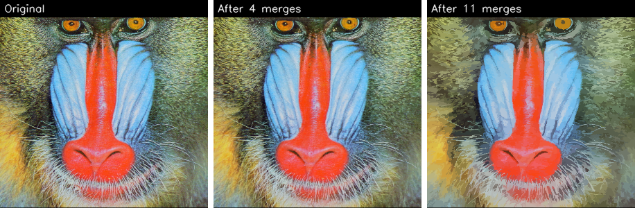

# region-unification

基于 **C++ / OpenCV** 从零实现的**图像区域合并（区域分割）算法**：将图像逐步合并为颜色相近的区域，得到“色块化”的分割结果。OpenCV 仅用于图像读写与显示，**区域标记、邻接关系构建与区域合并均为手动实现**（未使用 OpenCV 内置分割函数）。



---

## 算法

1. **初始区域标记**：按光栅顺序扫描，若当前像素与上方或左侧像素颜色相同则继承其区域标签，否则新建区域；同时累计每个区域的像素数与颜色和。
2. **邻接关系构建**：检查每个像素的右、下邻居，标签不同则两区域互为相邻。
3. **区域合并（迭代）**：每个区域与其**颜色距离最近的相邻区域**合并（合并到较小标签）；合并后更新标签、重算各区域的均值颜色与像素数。逐轮迭代，缓存每一级合并结果。
4. **输出**：每个像素取所属区域的均值颜色，得到区域统一后的图像。

实现细节：区域标签用 `CV_32S` 存储；均值颜色用 `Vec3f` 累加以避免精度损失。

## 使用

```bash
cmake -B build && cmake --build build --config Release
# 从仓库根目录运行（程序读取 images/baboon.jpg）
./build/region_unification        # Windows: .\build\Release\region_unification.exe
```

交互：窗口上的 **merge 滑动条**可查看不同合并级别的结果；按 **s** 保存当前结果，按 **ESC** 退出。

## 环境

Windows · Visual Studio (MSVC, x64) · OpenCV 4.12

## 许可证

[MIT](LICENSE)。示例图片（baboon 等）为通用图像处理测试图。
